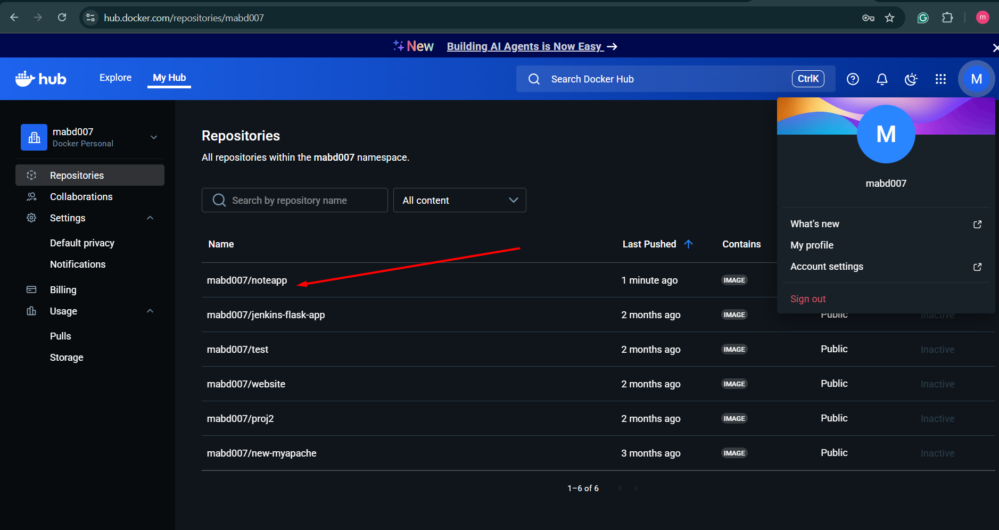

# CI/CD Pipeline with Jenkins, Kubernetes, and Ansible

## Project Overview

This project demonstrates the implementation of a robust CI/CD pipeline using Jenkins, Kubernetes, and Ansible. The pipeline automates the build, test, and deployment processes for containerized applications, ensuring reliable and efficient software delivery.


---

### Architecture

The infrastructure consists of the following components:

1. **Provisioner Server**
   - Runs Ansible for configuration management
   - Hosts Jenkins Master for pipeline orchestration

2. **KMaster-JenSlave**
   - Java and Docker environment
   - Kubernetes Master node
   - Functions as Jenkins Slave

3. **Slave Nodes**
   - Slave01 and Slave02: Worker nodes
   - Docker runtime for container execution
   - Kubernetes worker nodes for application deployment


## Prerequisites

### Required Tools and Versions

- Terraform (>= 1.0.0)
- Ansible (>= 2.9)
- Jenkins (>= 2.375.2)
- Docker (>= 20.10)
- Kubernetes (>= 1.30)
- Java (>= 17)


### Network Requirements
- All nodes must be able to communicate with each other
- Internet access for package installation
- SSH access between all nodes

---

## Steps

### 1. Initialize and Apply Terraform Configuration

```bash
# Initialize Terraform working directory
terraform init

# Review the infrastructure plan
terraform plan

# Apply the configuration
terraform apply -auto-approve
```


## Setting Up the Environment

### 1. Verify Ansible Installation

Ansible should get install via terraform user data. ensure Ansible is properly installed on the Provisioner Server:

```bash
ansible --version
```

Expected output should show Ansible showcasing the latestversion.

---

### 2. Configure SSH Authentication

For seamless automation, we need to set up passwordless SSH authentication between nodes.

#### 2.1 Generate SSH Key Pair

On the Provisioner Server (Ansible control node):

```bash
# Generate a new SSH key pair
cd ~/.ssh/
ssh-keygen -t rsa -b 4096 -C "ansible-control@provisioner"

# You will be prompted for:
# - Key file location (press Enter for default)
# - Passphrase (leave empty for automation purposes)
```

#### 2.2 Distribute SSH Keys

Copy the public key to all target machines (KMaster and Slave nodes):

```bash
# Display the public key content
cat ~/.ssh/id_rsa.pub

# On each target machine:
# 1. Create .ssh directory if it doesn't exist
mkdir -p ~/.ssh

# 2. Add the public key to authorized_keys
echo "YOUR_PUBLIC_KEY_CONTENT" >> ~/.ssh/authorized_keys

# 3. Set proper permissions
chmod 700 ~/.ssh
chmod 600 ~/.ssh/authorized_keys
```

   ## Step 3: Set Proper Permissions

      On both machines, ensure correct permissions:

      bash

      ```bash
      # On both machines
      chmod 700 ~/.ssh
      chmod 600 ~/.ssh/authorized_keys
      chmod 600 ~/.ssh/id_rsa      # private key (control machine only)
      chmod 644 ~/.ssh/id_rsa.pub
      ```

#### 2.3 Verify SSH Connectivity

Test SSH connection to each target machine:

```bash
ssh ubuntu@<target-machine-ip>
```

You should be able to connect without entering a password.

---


### 3. Configuring Ansible and Installating  Java, Jenkins, K8s among Master and Slave via Ansible Playbook

#### 3.1 Create Inventory File

Create an Ansible inventory file to define your infrastructure. You can either:
- Modify the default inventory at `/etc/ansible/hosts`, or
- Create a new inventory file (recommended)

```bash
# Create a new inventory file
mkdir -p ~/ansible-k8s
vi ~/ansible-k8s/inventory.ini
```

- Add the following content:

```ini
# Kubernetes Master Node
[k8s-master]
KMaster-JenSlave ansible_host=10.0.1.137 ansible_user=ubuntu

# Kubernetes Worker Nodes
[k8s-workers]
Slave01 ansible_host=10.0.1.67 ansible_user=ubuntu
Slave02 ansible_host=10.0.1.207 ansible_user=ubuntu

# Group for all Kubernetes nodes
[k8s-cluster:children]
k8s-master
k8s-workers

# Common variables for all nodes
[all:vars]
ansible_ssh_private_key_file=~/.ssh/id_rsa
ansible_ssh_common_args='-o StrictHostKeyChecking=no'
```

#### 3.2 Test Ansible Connectivity

- Verify that Ansible can communicate with all nodes:

```bash
# Test using inventory file
ansible -i ~/ansible-k8s/inventory.ini all -m ping
```
- Expected output should show "SUCCESS" for all nodes.

#### 3.2 After Configuring Ansible, Run the  to install following

- On Provisioner Server: Java, Jenkins.
- On KMaster-JenSlave : K8s(kubelet kubeadm kubectl), Java
- On Slave01 & 02:  K8s(kubelet kubeadm kubectl)

---


## 4. Then manually Execute the commands from the file  fileONLY on "Master Node" For the instializong, Configuring Kubectl, Creating the hash for Slaves to join.


## 5. Then manually Executing the below commands  on "Kubernetes Slave Node " for joining the Master.

```
sudo -i
# Perform pre-flight checks
sudo kubeadm reset pre-flight checks

#Paste the join command you got from the master node and append `--v=5` at the end but first use sudo su command to become root (avoid using sudo your-token).

   #sudo su -
   #<your-token --v=5>

For example::

#kubeadm join 172.31.21.59:6443 --token tcptrq.8e1ewzgab9s0iz56 \
        --discovery-token-ca-cert-hash sha256:4f0370a7efa0fdeca7f9a20fbe8e061840a0fc931878efef005e292f71221a02 --v=5


```

- After Joining the Slave to the Master, you should be able to the Slaves as nodes under Master.


```
kubectl get nodes
```

- Verification  **On Master Node:**


## 6. Then Proceed with the Installation of the Docker on both Slaves and Master by following 


## 7. Jenkins Setup and Pipeline Configuration

### 7.1 Configure Jenkins

1. Access Jenkins web interface at `http://<provisioner-ip>:8080`
2. Retrieve initial admin password:
   ```bash
   sudo cat /var/lib/jenkins/secrets/initialAdminPassword
   ```
3. Install recommended plugins
4. Create admin user
5. Configure Jenkins URL

### 7.2 Set Up Jenkins Agents

1. Navigate to "Manage Jenkins" > "Manage Nodes and Clouds"
2. Add new node for KMaster-JenSlave
3. Configure node with:
   - Name: `KMaster-JenSlave`
   - Permanent Agent
   - Remote root directory: `/home/ubuntu/jenkins`
   - Launch method: SSH
   - Host: `10.0.1.137`
   - Credentials: Add SSH credentials from earlier setup
4. Save and connect to the agent


### 8. Step-by-Step Creating a CI/CD Pipeline

 1. #### Setting up the Github for webhook by adding the Jenkins URL

http://<jenkins>/github-webhook/


- Import Docker Credentails in Jenkins

- Go to into Credentails options
- Go to Jenkins > Manage Jenkins > Manage Credentails
- Go to System
- Go to Global credentials (unrestricted)
- Go to Add Credentials
- Select kind > username with password
- Go to Scope > Global
- Go to Username > your docker hub username
- Go to Password > your docker hub password
- Go to ID > dockerhub (you can give any name)
- Go to Description > Docker Hub Credentails
- Click OK


 2. #### Create a Pipeline that triggers with the Github
- Go to Jenkins Dashboard > New Item
- Enter an item name (e.g., "MyPipelinev1")
- Select "Pipeline" and click OK
-  Under Tiggrer seltect `GitHub hook trigger for GITScm polling`
- under Pipeline give below script.

```grovy
pipeline {
    agent none
    environment {
        DOCKERHUB_CREDENTIALS = credentials("13d9af56-2f00-4895-8323-1b54940a4446")
    }
    stages {
    stage('git') {
      agent {
        label "k8s-master"
      }
      steps {
        script {
          git branch: 'main', url: 'https://github.com/Ab-Cloud-dev/Web-CiCD.git'
        }
      }
    }
  }
}
```


- Verifying the git got cloned.


 3. #### First we will

- Select the global Domain under system and Add credentails > username of the docker n password.copy the id and paste in the pipeline

 - Now the pipline script should be


```
pipeline {
    agent none
    environment {
        DOCKERHUB_CREDENTIALS = credentials("f9c9d35d-841f-4522-b135-5de3f68ed358")
    }
    stages {
        stage('git') {
            agent {
                label "KMasterNode"
            }
            steps {
                script {
                    git branch: 'main', url: 'https://github.com/Ab-Cloud-dev/Web-CiCD.git'
                }
            }
        }
        stage('docker') {
            agent {
                label "KMasterNode"
            }
            steps {
                script {
                    sh 'sudo docker build . -t mabd007/noteapp'
                    sh 'sudo docker login -u ${DOCKERHUB_CREDENTIALS_USR} -p ${DOCKERHUB_CREDENTIALS_PSW}'
                    sh 'sudo docker push mabd007/noteapp'
                }
            }
        }
	}
}
```
   - as we can see Docker images/image got uploaded to Docker Hub




 - Now we will push full  script so to make the pods from our pushed docker images/image after editing the images/image name in deployment.yaml


 - And we have see the


---

## Troubleshooting

### Common Issues and Solutions

1. **Jenkins Agent Connection Issues**
   - Verify SSH key permissions
   - Check network connectivity
   - Ensure Java is installed on the agent

2. **Kubernetes Deployment Failures**
   - Check pod logs: `kubectl logs <pod-name>`
   - Verify node resources: `kubectl describe node`
   - Check deployment status: `kubectl get deployments`

3. **Docker Build Failures**
   - Verify Docker daemon is running
   - Check disk space
   - Ensure network access to Docker registry

### Useful Commands

```bash
# Check Jenkins service status
sudo systemctl status jenkins

# View Jenkins logs
sudo tail -f /var/log/jenkins/jenkins.log

# Check Kubernetes cluster status
kubectl get nodes
kubectl get pods --all-namespaces

# View Docker logs
sudo journalctl -fu docker
```